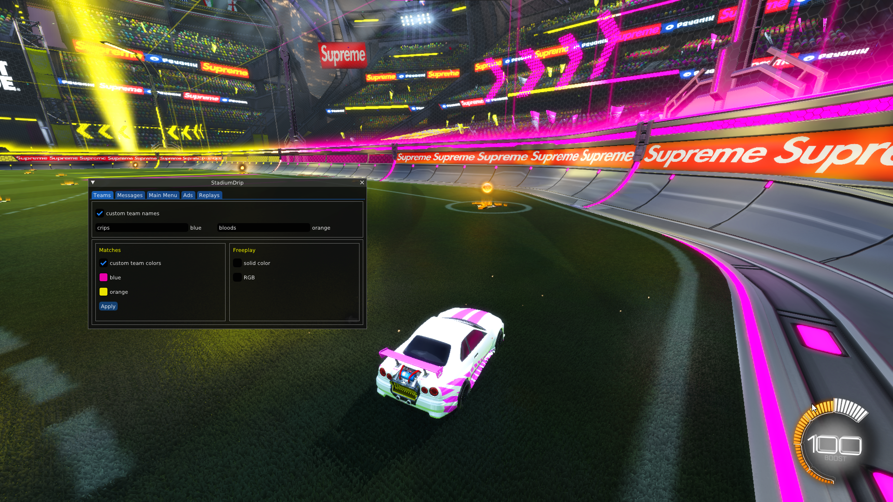

# Stadium Drip (BakkesMod plugin)
A plugin to completely swag out your Rocket League experience 🥶💨♿💅💯

peep the stadium drip my guy 👀 

deadass

## ✨ Features
- Change stadium colors in matches and freeplay
  - Option to use RGB effect or a single field color in freeplay
- Set custom team names
- Set custom goal scored messages
  - Can be customized based on *who* scored (you/teammate/opponent)
- Set custom kickoff countdown messages
- Set custom rolling footer message at the bottom of menu screens
- Change your car location in main menu
- Change your FOV angle in main menu
- Change the main menu background map
- Replace stadium ads with a custom image
- Change the map when viewing a replay
  - Great for recording clips

## 🔧 How To Install
Find the latest version in [Releases](https://github.com/smallest-cock/StadiumDrip/releases)

1. Click `StadiumDrip.zip` to download it

2. Extract `StadiumDrip.zip`, and run `install.bat`

 

## 💻 Commands

| Command | Description |
|---|---|
`sd_apply_ad_texture` | apply selected ad texture to stadium
`sd_apply_team_names` | apply custom team names
`sd_apply_motd` | apply custom rolling footer message at the bottom of menu screens
`sd_show_ball_trail` | show the ball trail effect at all times
`sd_exit_to_main_menu` | exit to the main menu
`sd_forfeit` | forfeit the current match

## ☕ Support

If you enjoy this plugin, consider funding my coffee addiction 🧡

